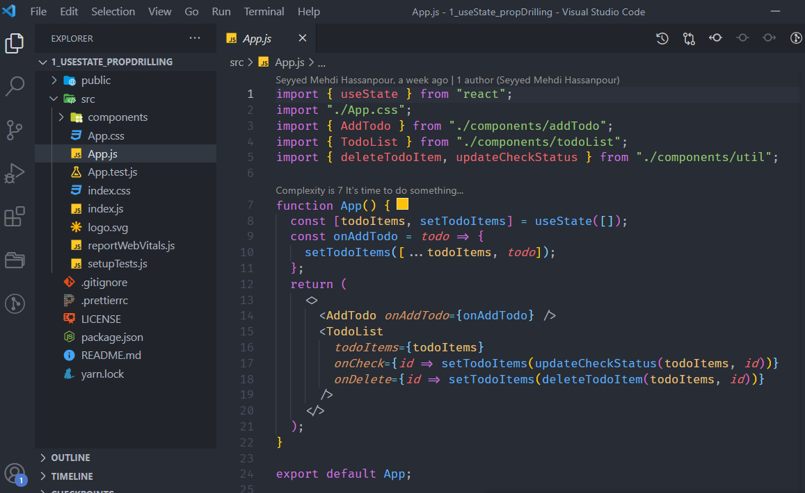
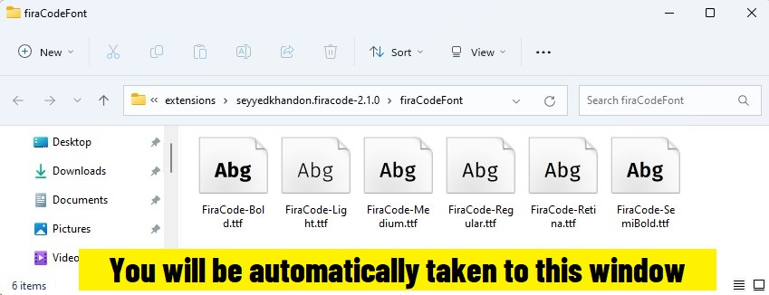
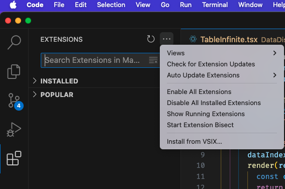

# NextDev Pack - Theme, font and useful Extension

#### VSCode `Icon`/`Theme`/`Font` pack



#### Final Step



When the **Font Directory** appears, install fonts if you haven't already, and restart VSCODE once you have.

**Note:** this is because of `OS` limitations, the `fonts must be installed manually`.

### Available Commands

- `Activate NextDev Pack Config`
- `Deactivate NextDev Pack Config`
- `Reset NextDev Pack Config`

**Note:** to run commands, press `ctrl+shift+p` to open the command palette, and then type each one and click on it.

<details>
<summary>
<i>Here are the configurations this plugin will use</i>
</summary>

```json
{
  "editor.fontLigatures": true,
  "workbench.iconTheme": "material-icon-theme",
  "workbench.colorTheme": "One Dark Pro",
  "editor.defaultFormatter": "esbenp.prettier-vscode",
  "editor.inlineSuggest.enabled": true,
  "editor.fontFamily": "'fira code'",
  "editor.fontLigatures": "true",
  "editor.fontWeight": "normal",
  "editor.fontSize": 12,
  "editor.codeActionsOnSave": {
    "source.fixAll.eslint": "always",
    "source.fixAll": "always"
  }
}
```

</details>

## Extensions Included

- 1- [One Dark Pro](https://marketplace.visualstudio.com/items?itemName=zhuangtongfa.Material-theme) - Atom's iconic One Dark theme for Visual Studio Code
- 2- [Material Icon Theme](https://marketplace.visualstudio.com/items?itemName=PKief.material-icon-theme) - Material Design Icons for Visual Studio Code
- 3- [FiraCode Font](https://marketplace.visualstudio.com/items?itemName=SeyyedKhandon.firacode) - Professional Font for Developers
- 4- [Prettier](https://marketplace.visualstudio.com/items?itemName=esbenp.prettier-vscode) - Code formatter
- 5- [Sublime Text Keymap](https://marketplace.visualstudio.com/items?itemName=ms-vscode.sublime-keybindings) - Sublime Text keybindings
- 6- [Tailwind CSS IntelliSense](https://marketplace.visualstudio.com/items?itemName=bradlc.vscode-tailwindcss) - Tailwind CSS IntelliSense
- 7- [Material Theme](https://marketplace.visualstudio.com/items?itemName=zhuangtongfa.material-theme) - Material Design theme for Visual Studio Code
- 8- [Material Product Icons](https://marketplace.visualstudio.com/items?itemName=PKief.material-product-icons) - Product Icons for Visual Studio Code
- 9- [Codeium AI](https://marketplace.visualstudio.com/items?itemName=Codeium.codeium) - AI-powered code autocomplete
- 10- [EditorConfig](https://marketplace.visualstudio.com/items?itemName=EditorConfig.EditorConfig) - EditorConfig Support
- 11- [ESLint](https://marketplace.visualstudio.com/items?itemName=dbaeumer.vscode-eslint) - Integrates ESLint into VS Code
- 12- [Code Spell Checker](https://marketplace.visualstudio.com/items?itemName=streetsidesoftware.code-spell-checker) - Spelling checker for your code
- 13- [I18n Ally](https://marketplace.visualstudio.com/items?itemName=Lokalise.i18n-ally) - Internationalization support
- 14- [Shell Format](https://marketplace.visualstudio.com/items?itemName=foxundermoon.shell-format) - Format shell scripts
- 15- [Path Intellisense](https://marketplace.visualstudio.com/items?itemName=christian-kohler.path-intellisense) - Autocomplete filenames

## One Click Install

`Currently it's support only local install`

Go to left side menu click on extention then click install from VSIX from [HERE](https://github.com/next-dev-team/npack/releases)



## Todo

- [ ] Option Pack for backend and front-end
- [ ] Check list before install
- [ ] Publish to vscode store

# Any Issue or feedback

[Feedback or Issue](https://github.com/next-dev-team/npack/issues)

## Template from tpack

- [Github](https://github.com/SeyyedKhandon/tpack)
